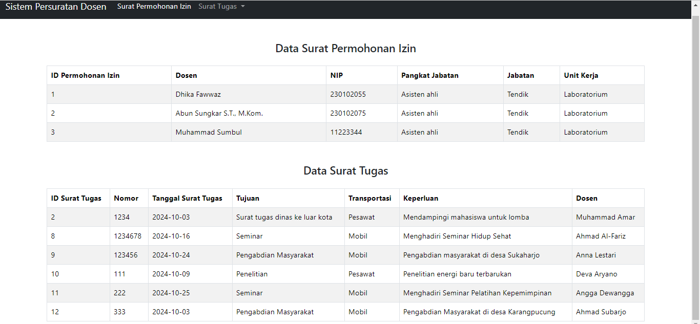

# Tugas 2 PWEB2
### Soal studi kasus:

1. Membuat View berbasis OOP, dengan mengambil data dari database MySQL
2. Gunakan _construct sebagai link ke database
3. Terapkan enkapsulasi sesuai logika studi kasus
4. Membuat kelas turunan menggunakan konsep pewarisan
5. Terapkan polimorfisme untuk minimal 2 peran sesuai studi kasus.

Tabel yang digunakan dalam sistem persuratan dosen adalah sebagai berikut.

1. Tabel Permohonan Izin


2. Tabel Surat Tugas


Penyelesaian:

Dalam studi kasus persuratan dosen terdapat surat permohonan izin dan surat tugas. Tabel yang digunakan adalah surat tugas dan permohonan izin. 

***Surat tugas digunakan untuk menampilkan informasi yang terkait dengan tugas dinas atau kegiatan akademik dosen, seperti penelitian, seminar, dan pengabdian masyarakat.***

 Beberapa atribut utama dari tabel surat tugas meliputi:

- `id_surat_tugas`: ID unik untuk setiap surat tugas yang dikeluarkan.
- `nomor`: Nomor surat tugas yang bersifat resmi.
- `tgl_surat_tugas`: Tanggal dikeluarkannya surat tugas.
- `tujuan`: Tujuan atau lokasi dari tugas yang diberikan.
- `transportasi`: Jenis transportasi yang digunakan selama melaksanakan tugas.
- `keperluan`: Keperluan atau alasan diberikannya tugas tersebut.
- `dosen`: Nama dosen yang menerima surat tugas.

***Surat izin digunakan untuk menampilkan data dosen yang membutuh surat izin sesuai dengan keperluan dosen. Kemudian data permohonan izin tersebut disimpan dalam tabel permohonan izin.***

Beberapa atribut yang terdapat dalam surat permohonan izin diantaranya sebagai berikut:

- `id_izin`: ID unik untuk setiap permohonan izin yang diajukan.
- `dosen`: Nama dosen yang mengajukan permohonan izin.
- `nip`: Nomor Induk Pegawai dari dosen yang bersangkutan.
- `pangkat_jabatan`: Pangkat dan jabatan dosen.
- `jabatan`: Jabatan struktural atau fungsional dosen.
- `unit_kerja`: Unit atau fakultas tempat dosen bertugas.
### Fungsi dari Sistem Persuratan Dosen Untuk Surat Permohonan Izin dan Surat Tugas
Dengan adanya Sistem Persuratan Dosen, proses administrasi terkait surat tugas dan izin dosen menjadi lebih efisien dan terdokumentasi dengan baik. Semua permohonan dapat dipantau secara real-time, dan riwayat pengajuan surat tersimpan secara terstruktur.

Berikut ini adalah langkah yang digunakan untuk menyelesaikan soal yang telah diberikan.

## 1. Membuat view berbasis OOP dengan mengambil data dari database mySQL
### Membuat view atau tampil.php
```php
<!DOCTYPE html>
<html lang="en">
<head>
    <meta charset="UTF-8">
    <meta name="viewport" content="width=device-width, initial-scale=1.0">
    <title>Daftar Permohonan Izin</title>
    <link href="https://cdn.jsdelivr.net/npm/bootstrap@5.3.3/dist/css/bootstrap.min.css" rel="stylesheet">
</head>
<body>

<!-- Navbar -->
<nav class="navbar navbar-expand-lg navbar-dark bg-dark">
    <div class="container-fluid">
        
        <a class="navbar-brand" href="tampil.php">Sistem Persuratan Dosen</a>
        <button class="navbar-toggler" type="button" data-bs-toggle="collapse" data-bs-target="#navbarNav" aria-controls="navbarNav" aria-expanded="false" aria-label="Toggle navigation">
            <span class="navbar-toggler-icon"></span>
        </button>
        <div class="collapse navbar-collapse" id="navbarNav">
            <ul class="navbar-nav">
                
            
            
            <li class="nav-item">
                    <a class="nav-link active" href="tampil_permohonan_izin.php">Surat Permohonan Izin</a>
                </li>

                
                
                <!-- Dropdown for Surat Tugas -->
                <li class="nav-item dropdown">
                    <a class="nav-link dropdown-toggle" href="#" id="suratTugasDropdown" role="button" data-bs-toggle="dropdown" aria-expanded="false">
                        Surat Tugas
                    </a>
                    <ul class="dropdown-menu" aria-labelledby="suratTugasDropdown">
                        <li><a class="dropdown-item" href="surat_penelitian.php">Surat Tugas Penelitian</a></li>
                        <li><a class="dropdown-item" href="surat_seminar.php">Surat Tugas Seminar</a></li>
                        <li><a class="dropdown-item" href="surat_pengabdian">Surat Tugas Pengabdian Masyarakat</a></li>
                        
                        
                    </ul>
                </li>
            </ul>
        </div>
    </div>
</nav>

<!-- Bootstrap JavaScript -->
<script src="https://cdn.jsdelivr.net/npm/bootstrap@5.3.3/dist/js/bootstrap.bundle.min.js"></script>
</body>
</html>


<!-- Konten Utama -->
<div class="container mt-5">
    <h4 class="text-center">Data Surat Permohonan Izin</h4>

    <table class="table table-bordered table-striped mt-4">
        <thead>
            <tr>
                <th scope="col">ID Permohonan Izin</th>
                <th scope="col">Dosen</th>
                <th scope="col">NIP</th>
                <th scope="col">Pangkat Jabatan</th>
                <th scope="col">Jabatan</th>
                <th scope="col">Unit Kerja</th>
            </tr>
        </thead>
        <tbody>
    <?php
    // Koneksi ke database dan query untuk mengambil data permohonan izin
    require_once('Database.php');
    require_once('permohonan_izin.php');
    // Cek apakah ada data yang tersedia
    if (!empty($dataIzin)) {
        // Loop untuk menampilkan setiap baris data
        foreach ($dataIzin as $row) {
            echo "<tr>
                <td>{$row['id_izin']}</td>
                <td>{$row['dosen']}</td>
                <td>{$row['nip']}</td>
                <td>{$row['pangkat_jabatan']}</td>
                <td>{$row['jabatan']}</td>
                <td>{$row['unit_kerja']}</td>
            </tr>";
        }
    } else {
        echo "<tr><td colspan='6' class='text-center'>Tidak ada data permohonan izin yang tersedia.</td></tr>";
    }
    ?>
        </tbody>
    </table>
</div>

<div class="container mt-5">
    <h4 class="text-center">Data Surat Tugas</h4>

    <table class="table table-bordered table-striped mt-4">
        <thead>
            <tr>
                <th scope="col">ID Surat Tugas</th>
                <th scope="col">Nomor</th>
                <th scope="col">Tanggal Surat Tugas</th>
                <th scope="col">Tujuan</th>
                <th scope="col">Transportasi</th>
                <th scope="col">Keperluan</th>
                <th scope="col">Dosen</th>
            </tr>
        </thead>
        <tbody>
    <?php
    // Koneksi ke database dan query untuk mengambil data permohonan izin
    require_once('Database.php');
    require_once('surat_tugas.php');
    // Cek apakah ada data yang tersedia
    if (!empty($dataTugas)) {
        // Loop untuk menampilkan setiap baris data
        foreach ($dataTugas as $row) {
            echo "<tr>
                <td>{$row['id_surat_tugas']}</td>
                <td>{$row['nomor']}</td>
                <td>{$row['tgl_surat_tugas']}</td>
                <td>{$row['tujuan']}</td>
                <td>{$row['transportasi']}</td>
                <td>{$row['keperluan']}</td>
                <td>{$row['dosen']}</td>
            </tr>";
        }
    } else {
        echo "<tr><td colspan='6' class='text-center'>Tidak ada data permohonan izin yang tersedia.</td></tr>";
    }
    ?>
        </tbody>
    </table>
</div>

<!-- Bootstrap JavaScript -->
<script src="https://cdn.jsdelivr.net/npm/bootstrap@5.3.3/dist/js/bootstrap.bundle.min.js">  </script>
</body>
</html>

```
Ini file tampil.php yang menampilkan data permohonan izin dan surat tugas menggunakan Bootstrap untuk styling dan PHP untuk koneksi dan pengambilan data dari database. Halaman tampil.php menyediakan dua tabel yang menampilkan data dari tabel permohonan_izin dan surat_tugas.

Berikut ini adalah bagian yang terdapat dalam file tampil.php, diantaranya yaitu:

- Navbar: Tersedia navigasi untuk berpindah antara halaman terkait persuratan dosen.
- Tabel Surat Permohonan Izin: Menampilkan data dari tabel permohonan_izin dengan kolom seperti ID Izin, Dosen, NIP, Jabatan, dan Unit Kerja.
- Tabel Surat Tugas: Menampilkan data dari tabel surat_tugas dengan kolom seperti ID Surat, Nomor, Tanggal, Tujuan, Transportasi, Keperluan, dan Dosen. Dan juga kink yang menghibungkan dropdown pada navbar terhun=bung dengan surat penelitian, surat seminar, dan surat pengabdian masyarakat.

***Pembuatan Databasae untuk persuratan dosen serta membuat tabel permohonan izin & surat tugas***

Tabel permohonan izin:

Tabel surat tugas:


Berikut ini adalah implemantasi coding dalam pembuatan database. File ini bernama database.php yang memiliki fungsi untuk memberikan koneksi database dengan oop.

Terdapat beberapa bagian dari class database, diantaranya dalah sebagai berikut:

### Properti:
- `$host`: Menyimpan alamat host untuk koneksi ke database (default: "localhost").
- `$db_name`: Menyimpan nama database yang akan digunakan (default: "persuratan_dosen").
- `$username`: Username untuk koneksi ke database (default: "root").
- `$password`: Password untuk koneksi ke database (default: kosong).
- `$conn`: Properti protected yang menyimpan objek koneksi database, dapat diakses oleh class turunan.

### Metode:
- `__construct()`: Constructor yang otomatis dijalankan saat objek `Database` dibuat. Metode ini berfungsi untuk membuat koneksi ke database menggunakan `mysqli` dan memeriksa apakah koneksi berhasil.
- `getConnection()`: Mengembalikan objek koneksi database yang dapat digunakan di luar class.
- `tampilData()`: Placeholder untuk metode yang akan digunakan untuk menampilkan data dari database. Implementasinya bisa ditambahkan sesuai kebutuhan.

Pembuatan class Databse dengan menggunakan properti untuk menyimpan deteil koneksi database.
```php
<?php
class Database {
    //Mendefinisikan properti untuk menyimpan detail koneksi database
    private $host = "localhost"; //alamat host untuk koneksi database
    private $db_name = "persuratan_dosen"; //nama database yang digunakan
    private $username = "root";  // username untuk koneksi ke database
    private $password = "";      // tidak ada spasi tambahan
    protected $conn;    // properti untuk menyimpan objek koneksi database yang dapat diakses oleh kelas turunan (karena protected)
```

##  2. Pembuatan constructor sebagai link ke Database
Pembuatan constructor untuk melakukan inisialisasi
```php
 //Constructor untuk menginisialisasi koneksi database saat objek dibuat
    public function __construct() {
        //membuat koneksi ke database menggunakan mysqli
        $this->conn = new mysqli($this->host, $this->username, $this->password, $this->db_name);
        //memeriksa apakah koneksi berhasil, jika tidak maka sistem akan menampilkan pesan error dan menghentikan eksekusi
        if ($this->conn->connect_error) {
            die("Connection failed: " . $this->conn->connect_error);
        }
    }
```
Pemberian metode getter yang digunakan untuk mengembalikan nilai dari objek yang telah diberikan
```php
    //Metode untuk mengembalikan objek koneksi, sehingga bisa digunakan di luar kelas ini
    public function getConnection(){
        return $this->conn;
    }
```
Pemberian metode function untuk menampilkan data
```php
    //Metode untuk menampilkan data
    public function tampilData(){

    }
}
?>
```
Berikut ini dalah coding secara keseluruhan untuk pembuatan class databse
```php
<?php

class Database {
    //Mendefinisikan prtoperti untuk menyimpan detail koneksi database
    private $host = "localhost"; //alamat host untuk koneksi database
    private $db_name = "persuratan_dosen"; //nama database yang digunakan
    private $username = "root";  // username untuk koneksi ke database
    private $password = "";      // tidak ada spasi tambahan
    protected $conn;    // properti untuk menyimpan objek koneksi database yang dapat diakses oleh kelas turunan (karena protected)


    //Constructor untuk menginisialisasi koneksi database saat objek dibuat
    public function __construct() {
        //membuat koneksi ke database menggunakan mysqli
        $this->conn = new mysqli($this->host, $this->username, $this->password, $this->db_name);
        //memeriksa apakah koneksi berhasil, jika tidak maka sistem akan menampilkan pesan error dan menghentikan eksekusi
        if ($this->conn->connect_error) {
            die("Connection failed: " . $this->conn->connect_error);
        }
    }
    //Metode untuk mengembalikan objek koneksi, sehingga bisa digunakan di luar kelas ini
    public function getConnection(){
        return $this->conn;
    }

    //Metode untuk menampilkan data
    public function tampilData(){

    }
}
?>
```
## 3. Menerapkan prinsip enkapsulasi
```php
<?php

class Database {
    //Mendefinisikan prtoperti untuk menyimpan detail koneksi database
    private $host = "localhost"; //alamat host untuk koneksi database
    private $db_name = "persuratan_dosen"; //nama database yang digunakan
    private $username = "root";  // username untuk koneksi ke database
    private $password = "";      // tidak ada spasi tambahan
    protected $conn;    // properti untuk menyimpan objek koneksi database yang dapat diakses oleh kelas turunan (karena protected)


    //Constructor untuk menginisialisasi koneksi database saat objek dibuat
    public function __construct() {
        //membuat koneksi ke database menggunakan mysqli
        $this->conn = new mysqli($this->host, $this->username, $this->password, $this->db_name);
        //memeriksa apakah koneksi berhasil, jika tidak maka sistem akan menampilkan pesan error dan menghentikan eksekusi
        if ($this->conn->connect_error) {
            die("Connection failed: " . $this->conn->connect_error);
        }
    }
```

- Atribut seperti $host, $db_name, $username, dan $password bersifat private. Ini berarti atribut-atribut ini hanya dapat diakses dan diubah di dalam kelas Database sendiri, dan tidak dapat diakses langsung dari luar kelas. Ini melindungi data sensitif seperti kredensial koneksi database.
- Atribut $conn bersifat protected, yang berarti hanya kelas Database dan kelas turunannya (subclass) yang dapat mengaksesnya. Ini memberikan fleksibilitas lebih jika nantinya ingin membuat kelas turunan yang juga memerlukan akses ke koneksi database.
- Koneksi ke database dikelola melalui constructor yang secara otomatis dipanggil saat objek dibuat, menjamin bahwa koneksi database hanya diinisialisasi ketika diperlukan.
### 4. Membuat class turunan dengan menggunakan konsep pewarisan atau inheritance
```php
<?php
// Menggunakan require_once untuk memastikan bahwa file 'surat_tugas.php' hanya dimuat satu kali.
// File ini kemungkinan berisi definisi kelas suratTugas yang akan digunakan di kelas suratPenelitian.
require_once 'surat_tugas.php';
// Mendefinisikan kelas suratPenelitian yang mewarisi (extends) kelas suratTugas.
class suratPenelitian extends suratTugas {
   

    // Mengambil semua data permohonan
    // Fungsi untuk menampilkan data dari tabel surat_tugas berdasarkan kolom 'tujuan'.
    public function tampilData($tujuan=null) {
        // Membuat query SQL untuk mengambil semua data dari tabel 'surat_tugas' yang memiliki tujuan tertentu.
        // Query ini akan mencocokkan nilai dari kolom 'tujuan' dengan parameter yang diberikan.
        $sql = "SELECT * FROM surat_tugas where tujuan = '".$tujuan."'";
        // Menjalankan query SQL menggunakan koneksi database yang diwarisi dari kelas induk suratTugas.
        $data = $this->conn->query($sql);
       // Mendefinisikan array kosong untuk menampung hasil data yang diperoleh dari query.
      
       $hasil = [];
       // Memeriksa apakah query berhasil dan apakah terdapat baris hasil data yang lebih dari 0 
       if ($data && mysqli_num_rows($data) >0) {
            while ($row = mysqli_fetch_array($data)) { // Mengambil setiap baris hasil query dan memasukkannya ke dalam array $hasil.
                $hasil[] = $row; // Setiap baris ditambahkan ke dalam array $hasil.
            }
        }
return $hasil; // Mengembalikan array $hasil yang berisi data dari query.

    
    }

    // Metode ini akan dioverride oleh kelas turunan
   
}

?>
```
Kelas suratPenelitian mewarisi kelas suratTugas dengan menggunakan kata kunci extends. Artinya, kelas suratPenelitian memiliki akses ke semua properti dan metode yang ada di kelas suratTugas, termasuk properti koneksi database ($conn) yang digunakan dalam metode tampilData().
Ini berarti suratPenelitian dapat menggunakan semua fungsi dan atribut dari kelas suratTugas tanpa perlu menulis ulang kode tersebut. Jika terdapat koneksi database atau metode lain di kelas suratTugas, kelas suratPenelitian dapat langsung menggunakannya atau mengubahnya sesuai kebutuhan.


- Pada kode ini, metode tampilData() menggunakan properti $conn yang diasumsikan telah dideklarasikan di kelas suratTugas. Karena $conn tidak dideklarasikan di dalam kelas suratPenelitian, maka koneksi ini diwarisi dari kelas suratTugas.
- Pewarisan memungkinkan kamu untuk membangun fitur tambahan pada kelas suratPenelitian tanpa mengganggu atau menyalin logika dari kelas induknya.

## Penerapan polimorfisme
```php
<?php
// Menggunakan require_once untuk memastikan bahwa file 'surat_tugas.php' hanya dimuat satu kali.
// File ini berisi definisi kelas suratTugas yang akan digunakan di kelas suratPenelitian.
require_once 'surat_tugas.php';
// Mendefinisikan kelas suratPenelitian yang mewarisi (extends) kelas suratTugas.
class suratPenelitian extends suratTugas {
   

    // Mengambil semua data permohonan
    // Fungsi untuk menampilkan data dari tabel surat_tugas berdasarkan kolom 'tujuan'.
    public function tampilData($tujuan=null) {
```
Polimorfisme melalui Method Overriding:
Polimorfisme terjadi ketika sebuah kelas turunan meng-override metode dari kelas induk, yang memungkinkan metode tersebut untuk berperilaku berbeda tergantung pada kelas mana ia dipanggil.
Dalam kasus ini, kelas suratSeminar mewarisi dari kelas suratTugas, dan ada metode tampilData() di dalam kelas suratSeminar yang digunakan sebagai polimorfisme.

Output:



